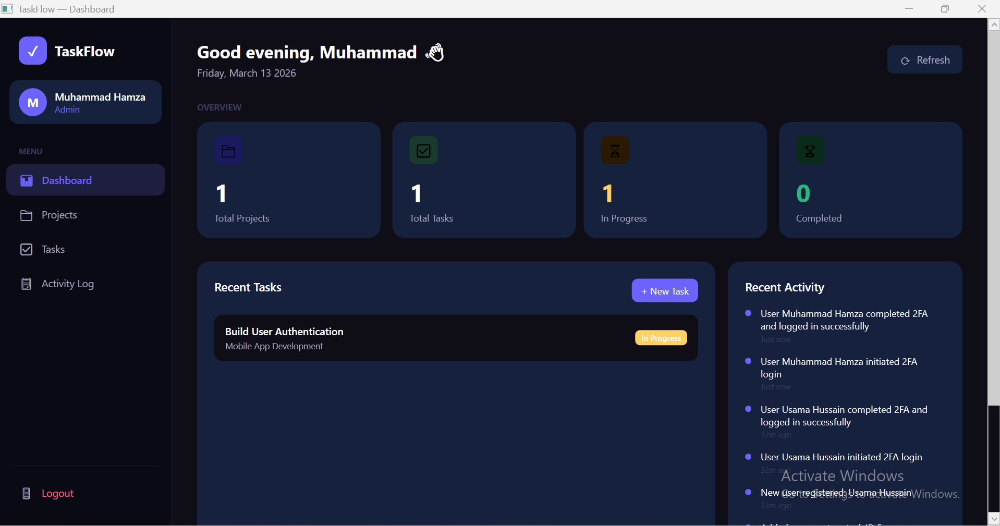
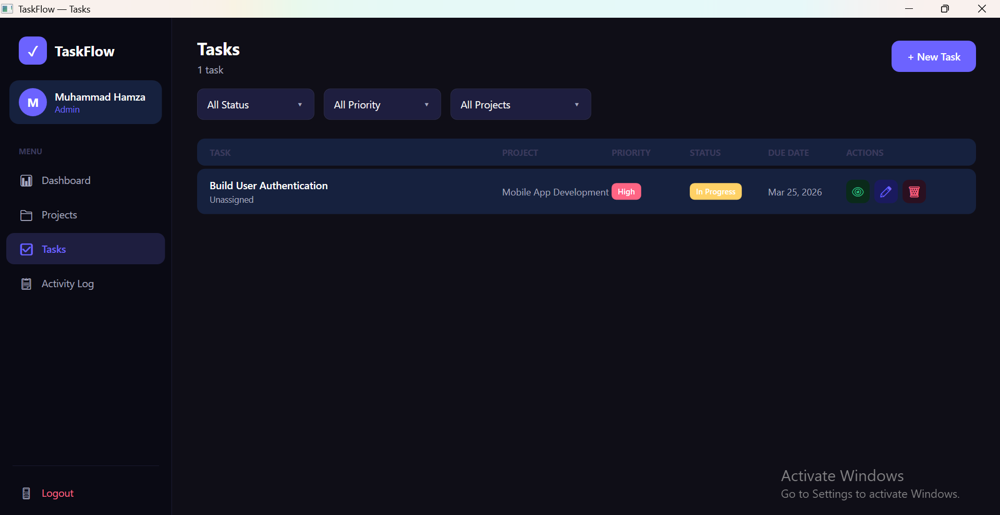
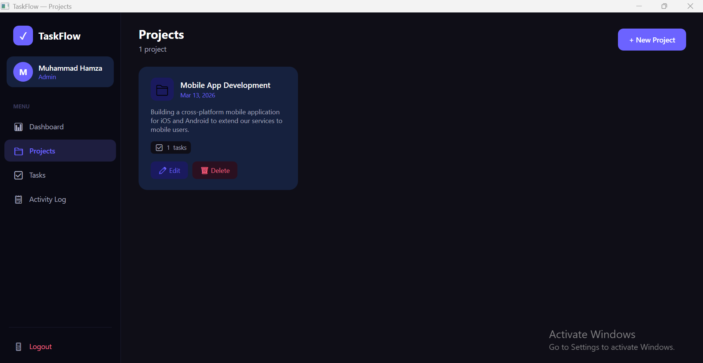
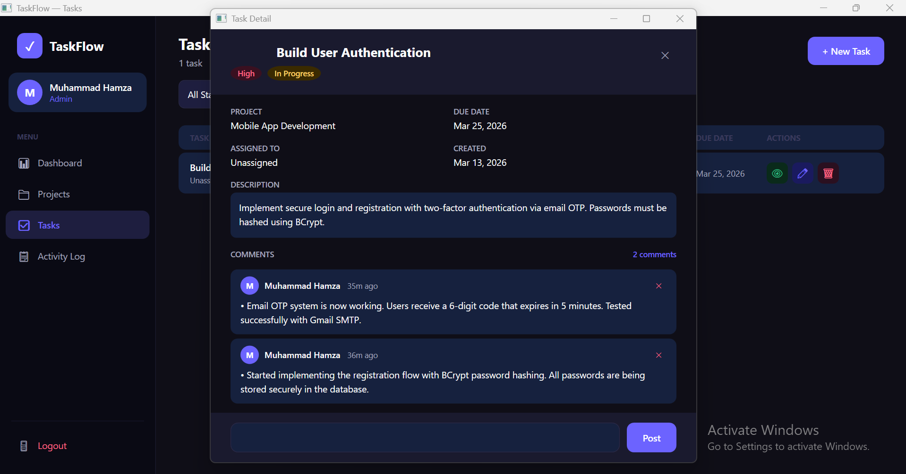
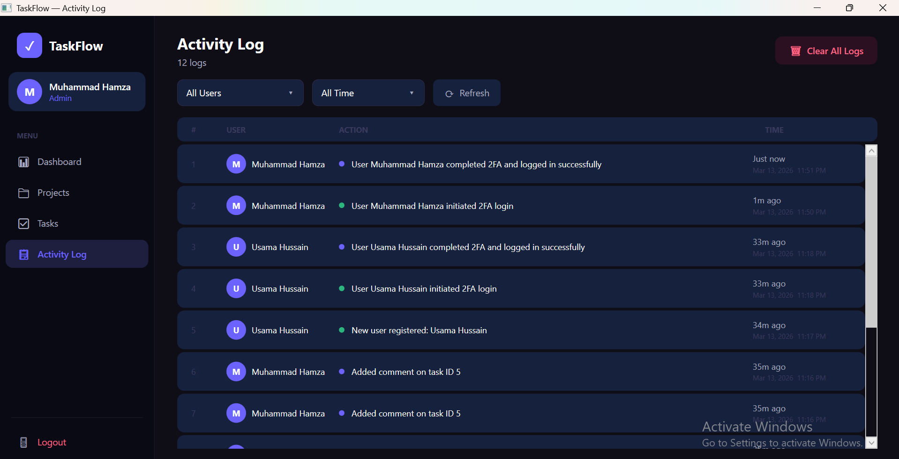
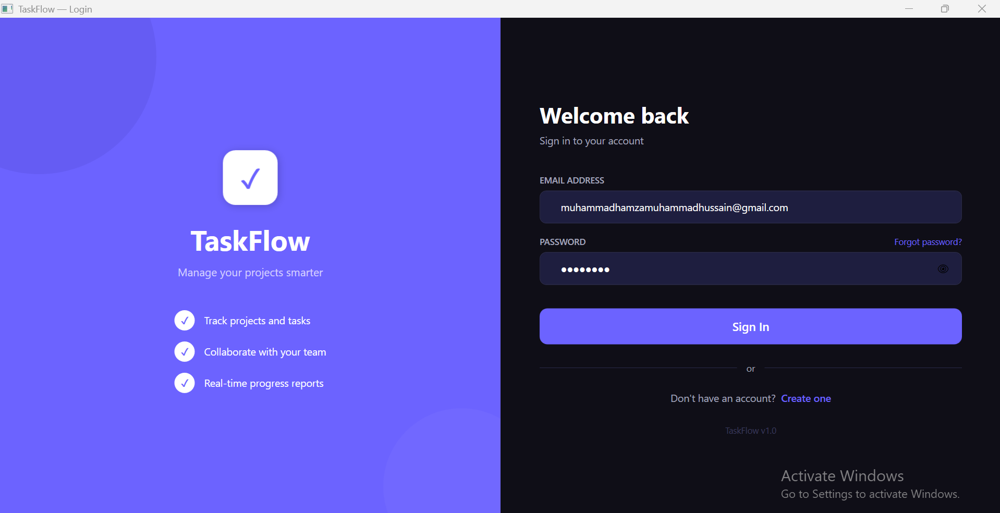

# TaskFlow 📋✅

> A modern, full-featured **Task Management Desktop Application** built with WPF, C# .NET 10 and SQL Server..

---

## 📸 Screenshots

| Dashboard | Tasks | Projects |
|-----------|-------|----------|
|  |  |  |

| Task Detail & Comments | Activity Log | Login |
|------------------------|--------------|-------|
|  |  |  |

---

## ✨ Features

### 🔐 Authentication & Security
- ✅ User **Registration** with full validation
- ✅ **Login** with email and password
- ✅ **Two-Factor Authentication (2FA)** via email OTP
- ✅ OTP expires after **5 minutes** with max **3 attempts**
- ✅ Passwords hashed with **BCrypt**
- ✅ Real email delivery via **Gmail SMTP (MailKit)**
- ✅ Session management with **SessionManager**

### 📊 Dashboard
- ✅ Personalised greeting based on time of day
- ✅ Stats cards — Total Projects, Total Tasks, In Progress, Completed
- ✅ Recent tasks overview
- ✅ Recent activity timeline
- ✅ Animated refresh button

### 📁 Projects
- ✅ Create, Edit and Delete projects *(Admin only)*
- ✅ Task count per project
- ✅ Slide-in form panel
- ✅ Full validation with error messages

### ✅ Tasks
- ✅ Create, Edit, Delete tasks
- ✅ Filter by **Status**, **Priority** and **Project**
- ✅ Priority badges — High 🔴, Medium 🟡, Low 🟢
- ✅ Status badges — Done, In Progress, To Do
- ✅ Due date colour coding — Overdue 🔴, Today 🟡
- ✅ Assign tasks to team members

### 💬 Comments
- ✅ View full task detail in a popup window
- ✅ Add and delete comments on tasks
- ✅ Timestamped with user avatar initials

### 📋 Activity Log *(Admin only)*
- ✅ Full audit trail of all user actions
- ✅ Filter by **User** and **Date Range**
- ✅ Colour-coded action dots
- ✅ Clear all logs *(Admin only)*
- ✅ Animated refresh button

### 🔒 Role-Based Access Control (RBAC)
| Feature | Admin | User |
|---------|-------|------|
| Create / Edit / Delete Projects | ✅ | ❌ |
| Create Tasks | ✅ | ✅ |
| Edit / Delete own tasks | ✅ | ✅ |
| Edit / Delete others' tasks | ✅ | ❌ |
| View Activity Log | ✅ | ❌ |
| Clear Activity Logs | ✅ | ❌ |

---

## 🏗️ Tech Stack

| Layer | Technology |
|-------|-----------|
| **Language** | C# 12 |
| **Framework** | .NET 10.0 WPF |
| **Database** | SQL Server LocalDB |
| **ORM** | Entity Framework Core 10 |
| **Authentication** | BCrypt.Net-Next |
| **Email** | MailKit (Gmail SMTP) |
| **Architecture** | MVVM-inspired, Code-behind |

---

## 🎨 Design System

| Token | Value |
|-------|-------|
| Background | `#0F0E17` |
| Surface | `#1A1A2E` |
| Card | `#16213E` |
| Primary | `#6C63FF` |
| Accent | `#FF6584` |
| Success | `#2CB67D` |
| Warning | `#FFD166` |
| Text | `#FFFFFE` |
| Muted | `#A7A9BE` |

---

## 🧱 OOP Concepts Demonstrated

This project was built to showcase core Object-Oriented Programming principles:

### 🔷 Abstraction
`BaseEntity` is an abstract class that defines the blueprint for all models with an abstract `GetDisplayInfo()` method.

### 🔷 Inheritance
All models (`User`, `Project`, `TaskItem`, `Comment`, `ActivityLog`) inherit from `BaseEntity`, gaining shared properties like `ID` and `CreatedDate`.

### 🔷 Encapsulation
Private fields with public property validation — for example `TaskItem` validates that `Priority` can only be `Low`, `Medium` or `High`, and `Status` can only be `To Do`, `In Progress` or `Done`.

### 🔷 Polymorphism
Every model overrides the abstract `GetDisplayInfo()` and `GetEntityType()` methods from `BaseEntity` to return meaningful, model-specific information.

---

## 🗄️ Database Schema

```
Users
├── ID, FullName, Email, PasswordHash, Role, CreatedDate

Projects
├── ID, ProjectName, Description, CreatedBy (FK → Users), CreatedDate

Tasks
├── ID, Title, Description, ProjectID (FK → Projects)
├── AssignedTo (FK → Users), CreatedBy, Priority, Status
├── DueDate, CreatedDate

Comments
├── ID, TaskID (FK → Tasks), UserID (FK → Users)
├── Content, CreatedDate

ActivityLogs
├── ID, UserID (FK → Users), Action, CreatedDate
```

---

## 🚀 Getting Started

### Prerequisites
- Windows 10/11
- Visual Studio 2022+
- .NET 10 SDK
- SQL Server LocalDB

### Installation

**1. Clone the repository**
```bash
git clone https://github.com/YOUR_USERNAME/TaskFlow.git
cd TaskFlow
```

**2. Open in Visual Studio**
```
Open TaskManagementApp.sln
```

**3. Set up email (for OTP)**

Open `Helpers/EmailService.cs` and update:
```csharp
private const string SenderEmail    = "your_gmail@gmail.com";
private const string SenderPassword = "your_16_char_app_password";
```

> To get a Gmail App Password: Google Account → Security → 2-Step Verification → App Passwords

**4. Run database migrations**
```
Tools → NuGet Package Manager → Package Manager Console

Add-Migration InitialCreate
Update-Database
```

**5. Run the application**
```
Press F5
```

---

## 📁 Project Structure

```
TaskManagementApp/
│
├── 📂 Data/
│   └── AppDbContext.cs              # EF Core DbContext & model configuration
│
├── 📂 Helpers/
│   ├── ActivityLogger.cs            # Logs user actions to database
│   ├── EmailService.cs              # Gmail SMTP OTP email sending
│   └── SessionManager.cs           # Static session & OTP state management
│
├── 📂 Models/
│   ├── BaseEntity.cs                # Abstract base class (Abstraction)
│   ├── User.cs                      # User model
│   ├── Project.cs                   # Project model
│   ├── TaskItem.cs                  # Task model with validation
│   ├── Comment.cs                   # Comment model
│   └── ActivityLog.cs               # Activity log model
│
├── 📂 Views/
│   ├── LoginWindow.xaml(.cs)        # Login screen with 2FA
│   ├── RegisterWindow.xaml(.cs)     # Registration with strength meter
│   ├── OTPWindow.xaml(.cs)          # 6-digit OTP verification
│   ├── DashboardWindow.xaml(.cs)    # Main dashboard with stats
│   ├── ProjectsWindow.xaml(.cs)     # Project management
│   ├── TasksWindow.xaml(.cs)        # Task management with filters
│   ├── TaskDetailWindow.xaml(.cs)   # Task detail & comments
│   └── ActivityLogWindow.xaml(.cs)  # Activity audit log
│
└── App.xaml                         # Global styles & theme
```

---

## 👨‍💻 Author

**Muhammad Hamza**

Software Developer

[](https://github.com/YOUR_USERNAME)
[](https://linkedin.com/in/YOUR_USERNAME)

---


<p align="center">Built with 💜 using WPF & C# .NET 10</p>
